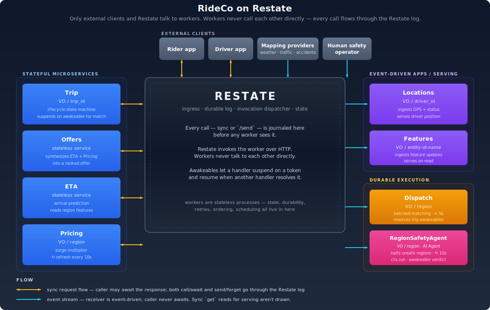

# RideCo on Restate

RideCo is a working ride-hailing backend built on
[Restate](https://restate.dev). Twelve stateless services — eight app
services (Trip, Offers, ETA, Pricing, Locations, Features, Dispatch,
RegionSafetyAgent) and four sim services that play the role of external
clients (RiderSim, DriverSim, MappingSim, plus a SimControl fan-out
service). All state, durability, retries, ordering, and scheduling
live inside Restate.

The repo is a reproducible demo. One terminal, a single TUI command, no
Kafka, no Redis, no separate workflow engine, no agent framework. Just
Restate plus stateless application code.



## How Restate fits in

> **Every service/handler in Restate automatically has a durable log in front of it.** Any invocation — sync RPC, async send, scheduled timer, webhook — is journaled in Restate's log *before* it executes. Durability, retry, ordering, observability — properties of every handler, transparently.

External clients (rider, driver, mapping providers, human operator) talk to
Restate's HTTP ingress. Restate journals the call and invokes the appropriate
service. **Services never call each other directly.** When a service uses
`ctx.call()` or `ctx.send()` from inside a handler, the call goes back
through Restate, which routes it onward. Restate is always the hub.

This only works because Restate built its own distributed log
specifically so durability can sit in the synchronous call path of every
service-to-service hop. A normal log adds milliseconds you can't afford
on each call; you'd never put one in the middle of a request/response
chain. Restate's log is purpose-built and fast enough to be in the
middle of every interaction without being a bottleneck. Think of it as
a service mesh where the connecting tissue is durable — a **Durable
Mesh**.

**`call()` vs `send()`.** Every handler supports both — the choice is at
the call site. `call()` is synchronous: the caller awaits the response.
`send()` is asynchronous: fire-and-forget, returns immediately. Both
journal the invocation in the Restate log first, so both are durable from
the moment Restate acks. A trip request that uses `call()` blocks waiting
for the result; a GPS ping that uses `send()` returns the moment Restate
has the message.

## All services are stateless

Each of the twelve services is an ordinary Python process behind hypercorn —
no local state, no RocksDB, no Redis sessions, no consumer-group offsets to
maintain. Services can be killed and restarted at will, scaled
horizontally without coordination, run anywhere a regular HTTP service can
run. **Every operational concern that usually sticks to "stateful services"
lives in Restate.** That's a substantial simplification: deploy stateless
services behind a load balancer, run a Restate cluster, done.

Because services are stateless and durability lives in Restate, they
can run on FaaS platforms — AWS Lambda, Google Cloud Run, Cloudflare
Workers, anywhere a function can serve HTTP. Cold-start a handler,
serve one invocation, scale to zero. The Restate log is the only thing
that has to be up; the services come and go.

## Virtual Objects

Most of RideCo's services are **Virtual Objects** keyed by a domain
identifier — Trip per `trip_id`, Pricing per `region`, Locations per
`driver_id`, Features per `entity:id:feature_name`. Two properties matter:

- **Per-key state.** A VO instance "always exists" for its key; state
  survives across processes and restarts.
- **Per-key serialization.** Exclusive handlers for the same key run
  one-at-a-time — no locks, no coordination service. Shared handlers
  (read-only) can run concurrently. This is why Dispatch's `close_epoch`
  for SF can't race itself, and why Trip's lifecycle stays consistent
  under concurrent updates.

## Four domains, plus serving

Restate covers four backend domains that have historically required separate
substrates. RideCo exercises all four:

**Event-driven applications.** Services triggered by events on a log. The
caller doesn't wait for a result, only for the event to be durable. In
RideCo: mapping providers publishing into Features, driver apps publishing
GPS pings into Locations, Trip sending into Dispatch.

**Stateful microservices.** Regular request/response services that may keep
per-key state. Callers await results synchronously. In RideCo: Trip, Offers,
ETA, Pricing — the synchronous application path from rider tap to quoted
offer.

**Durable Execution.** Long-running operations with automatic retries, a
durable journal that avoids re-running successful steps, timers (delayed
calls), and awakeables for human-in-the-loop or async waits. In RideCo:
Dispatch's batched matching rounds and RegionSafetyAgent's per-region monitor.

**AI agent infrastructure.** Per-agent state, suspend across long LLM calls,
human-in-the-loop via awakeables, deterministic replay of agent decisions —
all the same primitives the other three domains use, applied to LLM-driven
agents. In RideCo: RegionSafetyAgent.

**Serving** is a fifth concept layered on top of these: a service that
ingests events (event-driven app, write side) AND serves a derived view via
sync `get` reads (serving, read side). Locations and Features are both —
they receive fire-and-forget writes from external publishers and respond to
sync reads from internal consumers. Serving reads aren't drawn as request
arrows in the architecture diagram; they're implicit.

## Why no Kafka

This demo doesn't use Kafka anywhere. Every external write and every internal
hop goes to the Restate log via Restate's HTTP ingress.

The argument is short. Every Restate handler is durable from the moment
ingress acks the request — the Restate log handles the durable-input-queue
job a Kafka topic would otherwise do, without the cluster. For sync calls,
`call()` is just durable function-call ergonomics. For async, `send()`
writes to the same log. External publishers use `send()` the same way
internal callers do. For cadence, delayed sends replace cron and Airflow.

**Restate and Kafka coexist peacefully.** Restate has first-class Kafka
subscriptions (inbound) and producer support (outbound). But for
async/event-driven microservice workloads, Restate is just a better log:
lower latency, no consumer-group bookkeeping, durability and ordering tuned
for this exact workload. A Restate Kafka subscription literally just copies
messages from Kafka into the Restate log before any processing happens —
that extra copy is unnecessary when your producers can speak HTTP directly
to Restate in the first place. Many architectures that have Kafka today
simply don't need it.

## How to run

One terminal. The TUI owns the entire stack: Restate container,
the twelve service hypercorns, deployment registration, the sim
fleet — all of it.

Prereqs: Python 3.13 (or 3.11+), Docker, the
[`restate` CLI](https://docs.restate.dev/get_started/install), and `uv`
(or plain `pip`).

```bash
# Install once
uv venv --python 3.13 .venv
.venv/bin/python -m pip install -e .

# Launch
./scripts/tui.sh
```

On launch the TUI:

1. Brings up Restate via `docker compose up -d`
2. Spawns the twelve service hypercorns (each in its own process group)
3. Registers each deployment with Restate
4. Boots the sim fleet (`SimControl.start_all`)

Then it sits there and shows:

- a live **Regions table** — active / halted, halts count, risk score, dispatch epoch, idle drivers, pending / in-flight / done trip counts, pending awakeable id
- a live **Services table** — process status (running / dead / stopped), PID, last log line for every one of the 12 services
- a **Sims** strip — rider / driver counts, current rider rate, mapping interval, pause state
- a **Latest trip** ticker — the freshest enqueued trip across all regions, with status and surge multiplier
- a split **bottom row** — left side tails the selected service's log or shows the selected region's detail; right side shows that service's narrative (what it owns, what it calls, which Restate primitives it uses) OR the current demo step if you're walking through the guided tour

Press `q` to quit; the TUI tears down sims, hypercorns, and the Restate
container in order.

### Guided walkthrough

Press `d` to enter demo mode. Eight steps, mirroring the central
halt / approve / drain narrative end-to-end, with explicit callouts to
what to look for in the Restate UI:

1. Welcome / orientation
2. Phase 1 — the system is alive
3. The cadence loops (`Dispatch.close_epoch`, `Pricing.refresh`, `RegionSafetyAgent.tick` as delayed self-sends)
4. Phase 2 — spike SF unsafe (press `s`)
5. The halt (agent suspends on awakeable)
6. Phase 3 — approve & drain (press `a`)
7. Stream processing — Pricing reads a windowed ride-request rate from the Features aggregate
8. Now try the rest

`n` next step, `N` previous step, `o` opens your browser to the Restate
UI page that step references (Invocations, State browser for the
relevant VO, etc.). All other TUI keys keep working while reading a
step — the demo's whole point is telling you what to press.

### Key map

```
Quit / help / refresh
  q          quit (tears everything down)
  ?          show help
  r          refresh now

Regions table  (bottom-left shows live region detail)
  s          spike the selected region (25s of unsafe features)
  a          approve the selected region's pending awakeable
  m          make an ad-hoc trip in the selected region
  c          cancel the trip you just made
  p          poison the selected region's weather feature
  ctrl+r     full reset — wipe state, reboot the stack

Services table  (bottom-left tails the selected service's log;
                 bottom-right shows that service's narrative)
  k          kill the selected service process
  b          boot the selected service (re-registers with Restate)

Sims
  [ / ]      nudge per-rider rate down / up (step 0.05/s)
  shift+p    pause / resume riders + drivers + mapping

Trips
  t          open the trip-detail modal (defaults to the latest
             observed trip; type any trip id + Enter to retarget)

Demo
  d          toggle demo mode
  n / N      next / previous demo step
  o          open the Restate UI page this step references
```

### Restate Web UI — `http://localhost:9070`

The TUI shows operational + narrative state, the Web UI shows the
durable state Restate is keeping for you. Press `o` from inside the
TUI to jump straight to the page each demo step is talking about:

- **Overview** (`/ui/overview`) — every registered service and handler.
- **Invocations** (`/ui/invocations`) — live + historical. `running` is executing now; `scheduled` is a delayed self-send waiting to fire (you'll always see Dispatch.close_epoch, Pricing.refresh, RegionSafetyAgent.tick queued per region); `suspended` is paused on an awakeable (the safety agent, or any Trip.confirm waiting on a match). Status filter is the most useful control.
- **State** (`/ui/state/<VirtualObject>`) — per-VO key/value inspector. Drill into `RegionSafetyAgent` → SF to watch `region_active`, `halts`, `pending_awakeable` flip live; into `Features` to browse `events:region:*` keys and see the rolling timestamp samples for each event stream.

### Direct HTTP — same ingress the TUI and sims use

Every handler is reachable via Restate's ingress at `:8080`. The URL
pattern is `/{Service}/{key}/{handler}` for virtual objects (drop
`{key}` for plain services), append `/send` for fire-and-forget.

```bash
# Read a Trip VO's full state
curl -s -X POST http://localhost:8080/Trip/trip-abc123/get \
  -H 'Content-Type: application/json' -d '{}' | python3 -m json.tool

# Read the windowed ride-request rate for SF
curl -s -X POST 'http://localhost:8080/Features/events:region:SF:ride_request/event_rate' \
  -H 'Content-Type: application/json' -d '{}' | python3 -m json.tool

# Force a driver back to idle (call() — caller awaits)
curl -s -X POST http://localhost:8080/Locations/driver-001/set_status \
  -H 'Content-Type: application/json' -d '{"status":"idle","region":"SF"}'

# Fire-and-forget — append /send
curl -s -X POST http://localhost:8080/Pricing/SF/refresh/send \
  -H 'Content-Type: application/json' -d '{}'
```

Inspectors are just `call()`s like any other handler — each VO exposes
a `shared` (read-only) `get`. The TUI, the Web UI, and your own curl
all hit the same Restate ingress.

### Things worth trying

Press `d` for the walkthrough and follow that, then experiment:

- Press `k` on the Trip service while sims are running. Pending `Trip.confirm` invocations from sim_rider get queued in Restate's retry queue; press `b` to restart Trip and watch them drain on retry. No state lost.
- Spike NYC (Tab to Regions, arrow to NYC, press `s`) while SF is already halted. Two regions queued; one verdict per region to drain.
- Press `p` to poison a region's weather feature. The `Features.set` invocation for that key gets stuck retrying; subsequent set() calls for the same key queue up behind it. Every other Features key keeps working. Edit `rideco/services/features.py` (set `HANDLE_POISON_GRACEFULLY = True`), press `k` then `b` on the features service, and watch the stuck invocation drain.
- Press `]` a few times to push the rider rate up. Watch surge multiplier respond within a Pricing.refresh tick (10s) as the windowed request rate climbs.

## Per-service breakdown

How each service is shaped, what it owns, what it calls. Every row in
every "Calls" cell goes through Restate — `call()` is sync (caller
awaits), `send()` is async fire-and-forget into the Restate log,
self-`send()` with a delay replaces external schedulers.

### Trip — Stateful microservice

Per-trip lifecycle state machine. `confirm` is a long-running operation:
creates an awakeable, sends one-way to `Dispatch.enqueue_trip` carrying
the awakeable name, and **suspends** on the awakeable. When Dispatch's
next matching round resolves the awakeable with a `driver_id`, the same
`confirm` invocation resumes, records the assignment, and fans out to
Locations. After assignment, schedules a delayed self-send to `complete`
that flips the driver back to idle when the simulated ride ends. Trip →
Dispatch is a one-way dependency; Dispatch never imports Trip.

| | |
|---|---|
| **Domain** | Stateful microservices + Durable execution |
| **Shape** | Virtual Object keyed by `trip_id` |
| **Receives** | `call()`: `request_ride`, `confirm`, `cancel`, `complete` &nbsp;·&nbsp; shared read: `get` |
| **State** | `rider_id`, `origin`, `destination`, `region`, `status`, `offer`, `multiplier`, `assigned_driver_id`, `epoch_id`, `pending_match_awakeable` |
| **Calls** | `call()` → `Offers.generate` &nbsp;·&nbsp; `send()` → `Pricing.note_demand`, `Features.record_event` (one event per request into the rolling-window aggregate), `Dispatch.enqueue_trip` (with awakeable token), `Locations.accept_trip` &nbsp;·&nbsp; self-`send()` → `complete` (delayed) |

### Offers — Stateful microservice

Pure synthesis layer. Fans into ETA + Pricing in sequence, builds three
candidate offers per car class (Standard, XL, Lux), selects Standard.

| | |
|---|---|
| **Domain** | Stateful microservices |
| **Shape** | Plain service (no per-key state) |
| **Receives** | `call()` from Trip: `generate` |
| **State** | — |
| **Calls** | `call()` → `ETA.estimate`, `Pricing.quote` |

### ETA — Stateful microservice

Arrival-time predictor. Computes haversine distance, adjusts by region
features, returns ETA + reliability score.

| | |
|---|---|
| **Domain** | Stateful microservices |
| **Shape** | Plain service (no per-key state) |
| **Receives** | `call()` from Offers: `estimate` |
| **State** | — |
| **Calls** | `call()` → `Features.get` (region `weather`, `accident_density`) |

### Pricing — Stateful microservice

Per-region surge multiplier. The refresh loop is a delayed call to self
— no external scheduler. Multiplier reflects weather + accidents + a
**rolling 60s ride-request rate** read from the Features aggregate
(below). The cumulative `demand_count` only grows; the windowed rate
decays naturally, so surge responds to *recent* demand intensity.

| | |
|---|---|
| **Domain** | Stateful microservices + Durable execution |
| **Shape** | Virtual Object keyed by `region` |
| **Receives** | `call()` from Offers: `quote` &nbsp;·&nbsp; `send()`: `note_demand` (Trip), `note_supply` (DriverSim) &nbsp;·&nbsp; self-scheduled: `refresh` |
| **State** | `multiplier`, `supply_count`, `demand_count`, `last_refresh_ms` |
| **Calls** | `call()` → `Features.get` (weather, accidents), `Features.event_rate` (windowed request rate) &nbsp;·&nbsp; self-`send()` → `refresh` in 10s |

### Locations — Event-driven app + Serving

Per-driver position + status. Pings are fire-and-forget; the smoothing
(mocked here as an exponential moving average; production systems would
use a Marginalized Particle Filter) happens inside the handler. Position
reads via the shared `get_position` handler are the serving path.

| | |
|---|---|
| **Domain** | Event-driven apps + Serving |
| **Shape** | Virtual Object keyed by `driver_id` |
| **Receives** | `send()`: `ping` (driver app), `accept_trip` (Trip) &nbsp;·&nbsp; `call()`: `set_status` &nbsp;·&nbsp; shared read: `get_position` |
| **State** | `status`, `matched_lat`, `matched_lng`, `last_ping_ms`, `region`, `current_trip_id` |
| **Calls** | `send()` → `Dispatch.register_driver` / `deregister_driver` on status transitions |

### Features — Event-driven app + Serving + stream-processed aggregates

Online feature store with **two shapes on the same Virtual Object**:

- **Point-value features** (`set` / `get`) — last-write-wins. Used for
  `region:SF:weather`, `region:SF:accident_density`. External providers
  (Mapping in production, MappingSim here) `send()` writes; readers
  (ETA, Pricing, RegionSafetyAgent) `call()` `get`.
- **Aggregates over event streams** (`record_event` / `event_rate`) —
  rolling 60s window per key. Trip.request_ride fire-and-forget sends
  one event per ride request to `events:region:SF:ride_request`. The
  handler appends `now` to a per-key timestamp list and trims out
  samples older than the window. Pricing.refresh `call()`s the shared
  `event_rate` handler every 10s to read events/sec over the window
  and fold it into the surge multiplier.

The canonical "events in → windowed aggregate out → consumer service
decision" stream-processing pattern, hosted on the same VO that serves
the point-value features. Per-key state slots are independent (`value`
vs `samples`), and per-key exclusive handlers give each event stream a
single-writer queue without any explicit locking. Shared `event_rate`
readers don't block writers.

Per-key serialization also means a stuck handler on one key (the
poison-pill demo) blocks only that key while every other Features VO
keeps working — fault isolation at the key level.

| | |
|---|---|
| **Domain** | Event-driven apps + Serving + stream-processed aggregates |
| **Shape** | Virtual Object keyed by `{entity_type}:{entity_id}:{feature_name}` or `events:{...}` |
| **Receives** | `send()`: `set` (point value), `record_event` (stream sample) &nbsp;·&nbsp; shared reads: `get`, `event_rate` |
| **State** | per-key: either `{value, version, last_updated_ms}` OR `{samples}` (list of ms timestamps in the rolling window) |
| **Calls** | — |

### Dispatch — Durable execution

Long-running matcher. Each epoch: snapshot pending trips + driver
positions, greedy nearest-driver match, resolve each matched trip's
awakeable token with its `driver_id`. Unmatched trips carry forward.
Dispatch has no knowledge of Trip's state machine — it just resolves
tokens it was handed. When RegionSafetyAgent halts the region, the
epoch loop keeps ticking but matching is skipped; trips queue and drain
on resume.

| | |
|---|---|
| **Domain** | Durable execution |
| **Shape** | Virtual Object keyed by `region` |
| **Receives** | `send()`: `enqueue_trip` (Trip, with awakeable token), `register_driver` / `deregister_driver` (Locations), `set_active` (RegionSafetyAgent) &nbsp;·&nbsp; self-scheduled: `close_epoch` every 5s |
| **State** | `active`, `active_driver_ids`, `pending_trips` (each with its awakeable token), `epoch_id`, `loop_running` |
| **Calls** | `call()` → `Locations.get_position` (per active driver at epoch close) &nbsp;·&nbsp; `ctx.resolve_awakeable` per matched trip — Dispatch's only outbound communication &nbsp;·&nbsp; self-`send()` → `close_epoch` in 5s |

### RegionSafetyAgent — AI agent infrastructure

Per-region safety monitor. Every 10s, reads its region's features,
computes a composite risk via the mocked LLM, and decides whether to
halt dispatch. On halt: `send()`s `Dispatch.set_active(false)`, creates
an awakeable, suspends. A human resolves the awakeable with `approve`
(region resumes, `Dispatch.set_active(true)`) or `deny` (stays halted;
ticks continue but no re-escalation until something resumes the region).
Trips in the halted region queue in Dispatch's `pending_trips` and drain
on resume. One agent per region — SF can be halted while NYC, LA, SEA
keep matching.

| | |
|---|---|
| **Domain** | AI agent infrastructure |
| **Shape** | Virtual Object keyed by `region` |
| **Receives** | `send()`: `start_monitoring` (from MappingSim on bootstrap), `force_resume` (manual override) &nbsp;·&nbsp; self-scheduled: `tick` every 10s &nbsp;·&nbsp; external awakeable resolve from human operator &nbsp;·&nbsp; shared read: `get` |
| **State** | `active`, `region_active`, `ticks`, `halts`, `last_score`, `last_rationale`, `last_verdict`, `pending_awakeable` |
| **Calls** | `call()` → `Features.get` (region `weather`, `accident_density`) &nbsp;·&nbsp; `ctx.run_typed` for the composite risk score (journaled, deterministic on replay) &nbsp;·&nbsp; `send()` → `Dispatch.set_active(false)` to halt, `Dispatch.set_active(true)` on approve &nbsp;·&nbsp; `ctx.awakeable()` to suspend on a human verdict &nbsp;·&nbsp; self-`send()` → `tick` in 10s |

The AI-agent showcase: per-key state, mocked LLM via `ctx.run`, awakeable
for human-in-the-loop gating, all on Restate's durable runtime. Same
primitives the other seven services use, applied to LLM-driven decisions.

## Sim services

Even the load generators are built on Restate. `RiderSim`, `DriverSim`,
and `MappingSim` are Virtual Objects with their own durable cadence
loops, paused and tuned via the same `call()` / `send()` primitives the
app uses. `SimControl` is a fan-out controller — one call to
`start_all` boots the whole fleet; one call to `stop_all` pauses it.

This sharpens the pitch: there's no "and we also have a Python load
generator on the side." The sims look like external clients from the
app's perspective (each `RiderSim.tick` calls `Trip.request_ride` like
any other caller), but they're durable Restate services themselves —
state survives restarts, cadence loops survive service churn, every emit
journals through the same log.

### RiderSim — load generator (Stateful microservice + Durable execution)

Each rider VO owns its own rate and trip counter. `tick` picks a random
region, fires `Trip.request_ride` + `Trip.confirm`, and self-sends the
next `tick` with a Poisson-jittered delay.

| | |
|---|---|
| **Domain** | Stateful microservices + Durable execution |
| **Shape** | Virtual Object keyed by `rider_id` |
| **Receives** | `call()`: `start`, `pause`, `resume`, `set_rate` &nbsp;·&nbsp; self-scheduled: `tick` (Poisson-jittered) &nbsp;·&nbsp; shared read: `get` |
| **State** | `active`, `rate`, `trips_started`, `last_trip_id`, `last_region` |
| **Calls** | `call()` → `Trip.request_ride` &nbsp;·&nbsp; `send()` → `Trip.confirm` &nbsp;·&nbsp; `ctx.run_typed` for jittered origin/destination/region/delay (journaled) &nbsp;·&nbsp; self-`send()` → `tick` |

### DriverSim — load generator (Stateful microservice + Durable execution)

Each driver VO owns its position and ping cadence. On first start it
registers as IDLE with `Locations` and bumps regional supply. The
`tick` loop drifts the position and sends a `ping`.

| | |
|---|---|
| **Domain** | Event-driven apps + Durable execution |
| **Shape** | Virtual Object keyed by `driver_id` |
| **Receives** | `call()`: `start`, `pause`, `resume` &nbsp;·&nbsp; self-scheduled: `tick` every `ping_interval_s` &nbsp;·&nbsp; shared read: `get` |
| **State** | `active`, `region`, `lat`, `lng`, `ping_interval_s`, `pings_sent` |
| **Calls** | `call()` → `Locations.set_status(idle)` on first start &nbsp;·&nbsp; `send()` → `Locations.ping`, `Pricing.note_supply` &nbsp;·&nbsp; self-`send()` → `tick` |

### MappingSim — load generator (Event-driven app + Durable execution)

Per-region weather + accident feed. On first start it bootstraps that
region's `Pricing.refresh` and `RegionSafetyAgent.start_monitoring`
loops, then ticks on its own interval to emit fresh feature values.

| | |
|---|---|
| **Domain** | Event-driven apps + Durable execution |
| **Shape** | Virtual Object keyed by `region` |
| **Receives** | `call()`: `start`, `pause`, `resume`, `set_interval` &nbsp;·&nbsp; self-scheduled: `tick` every `interval_s` &nbsp;·&nbsp; shared read: `get` |
| **State** | `active`, `interval_s`, `emits`, `last_weather`, `last_accidents` |
| **Calls** | `send()` → `Features.set` (weather + accident_density), `Pricing.refresh` (bootstrap), `RegionSafetyAgent.start_monitoring` (bootstrap) &nbsp;·&nbsp; `ctx.run_typed` for the random pick (journaled) &nbsp;·&nbsp; self-`send()` → `tick` |

### SimControl — fleet controller

Single-key fan-out service. `start_all` boots the whole fleet from one
call; `stop_all` pauses everything; `set_rider_rate` retunes every
rider VO at once. Operators (TUI, scripts, curl) drive sims through one
small surface instead of enumerating per-key VOs.

| | |
|---|---|
| **Domain** | Stateful microservices (control plane) |
| **Shape** | Virtual Object keyed by `"global"` (single instance) |
| **Receives** | `call()`: `start_all`, `stop_all`, `pause_riders`/`drivers`/`mapping`, `resume_*`, `set_rider_rate` &nbsp;·&nbsp; shared read: `get` |
| **State** | `drivers`, `riders`, `rider_rate`, `mapping_interval_s` |
| **Calls** | `send()` → fan-out to all `RiderSim`, `DriverSim`, `MappingSim` VOs |

## Low-level scripts (appendix)

The TUI is the primary entry point. The shell scripts under `scripts/`
are the building blocks the TUI itself orchestrates, and they remain
useful when you want to script around the system without the TUI.

| Script | Purpose |
|---|---|
| `./scripts/tui.sh` | Launch the TUI — primary entry point |
| `./scripts/serve-all.sh` | Launch all 12 services as separate hypercorn processes (foreground, Ctrl+C tears all down) — what the TUI does for you |
| `./scripts/register-all.sh` | Register all 12 deployments with Restate |
| `./scripts/stop.sh` | Kill anything listening on 9080–9091 |
| `./scripts/reset.sh` | Wipe Restate state and restart the container |
| `./scripts/make-trip.sh <id> <region>` | Rider request + confirm (sync; confirm waits for match) |
| `./scripts/cancel-trip.sh <id>` | Cancel a trip |
| `./scripts/spike-region.sh [region]` | Force a region's features into unsafe territory (triggers RegionSafetyAgent halt) |
| `./scripts/poison.sh [region]` | Publish the POISON sentinel into Features for that region |
| `./scripts/approve.sh <awakeable_id> [verdict]` | Resolve a suspended RegionSafetyAgent awakeable |
| `./scripts/set-feature.sh <region> <feature> <value>` | Write a feature directly via HTTP |
| `./scripts/show-trip.sh <id>` | Pretty-print Trip state |
| `./scripts/show-region.sh [region]` | Pretty-print one region's RegionSafetyAgent + Dispatch state |
| `./scripts/show-regions.sh` | One-shot table across all regions |
| `./scripts/show-invocations.sh` | `restate invocations list` with a status legend |
| `./scripts/watch-regions.sh` | Live dashboard (older curl-based version; the TUI's Regions table is the modern equivalent) |
| `./scripts/demo-t1.sh` / `demo-t2.sh` | Original three-terminal demo flow, superseded by the TUI |

## Versions

- **Restate server:** 1.6.2 (pinned in `docker-compose.yml`)
- **Restate Python SDK:** `restate_sdk[serde]` 0.18.0
- **Python:** 3.13
- **ASGI server:** Hypercorn (HTTP/2)

## Layout

```
rideco/
├── architecture.svg           # diagram, embedded above
├── docker-compose.yml         # restate-server 1.6.2 — the whole stack
├── hypercorn-config.toml      # ASGI defaults (per-service --bind passes overrides)
├── pyproject.toml             # restate_sdk[serde], hypercorn, httpx, rich, textual
├── Makefile                   # serve, register, stop
├── scripts/                   # tui.sh entry point + low-level building blocks
├── rideco/
│   ├── shared/                # types, region defs, logging (log_in / log_out / log)
│   ├── services/              # app: trip, offers, dispatch, locations, pricing,
│   │                          #      eta, features, region_safety_agent
│   │                          # sim: sim_rider, sim_driver, sim_mapping,
│   │                          #      sim_control (load generators on Restate)
│   ├── tui/                   # Textual app — owns the whole stack lifecycle
│   └── sim/                   # watch_regions — older external dashboard
```

Each service runs as its own hypercorn process on its own port. They
never call each other directly — every cross-service hop goes through
Restate, so killing or restarting one process has zero effect on the
others. The TUI owns the lifecycle of all twelve (each spawned in its
own process group so a kill cleans up cleanly).
