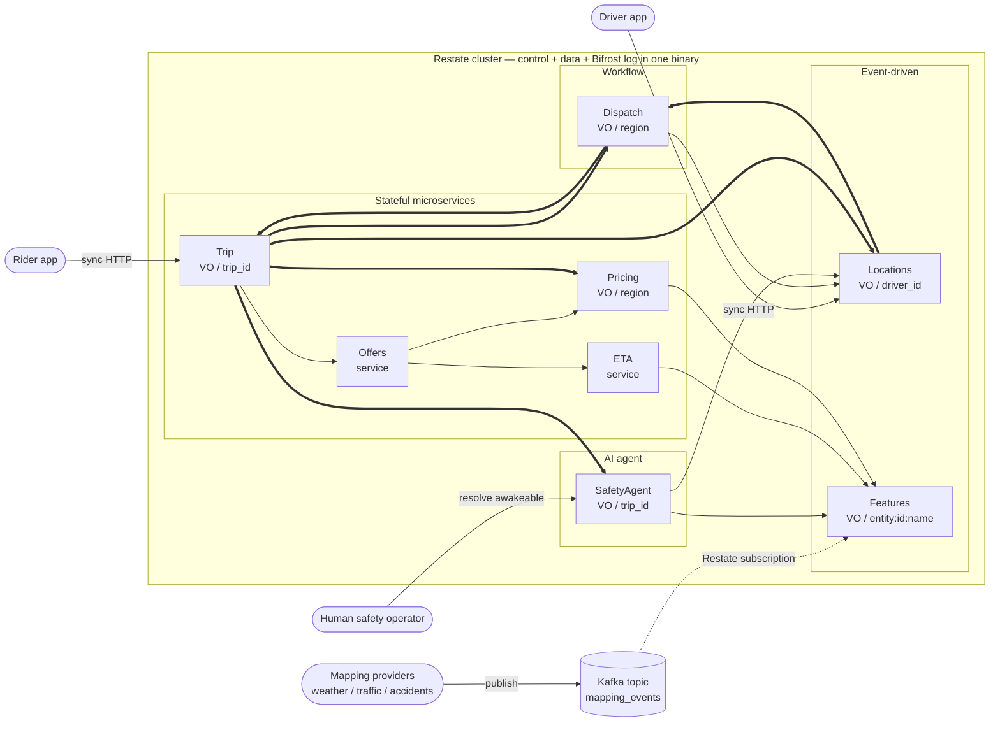

# RideCo — ride dispatch on Restate

RideCo is a fictional ride-hailing company invented to make the architecture
concrete. The artifact is a working slice of how you'd build the **next new
system** at a ride-hailing platform if Restate were the runtime — eight
services running on one stateful application platform instead of the usual
mix of Kafka + stream-processor + workflow-engine + ad-hoc queues + agent
framework.

This is not a migration pitch.

## The punchline

> **Every service/handler in Restate automatically has a durable log in front of it.** Any invocation — sync RPC, async send, Kafka subscription, scheduled timer, webhook — is journaled in Bifrost (Restate's internal log) *before* it executes. Durability, retry, ordering, observability — all the things Kafka was giving you for internal-bus use cases — are now a property of every handler, transparently.

You don't need Kafka for what Kafka was being used for most of the time. You
need it where it actually earns its keep: a durable log at trust boundaries,
with multiple independent push consumers, with retention measured in days.
For everything else — internal courier work between two services that already
know each other — Restate's `ctx.send()` writes to Bifrost and you get the
same durability without operating the Kafka cluster.

## The four domains this demonstrates

Restate is a stateful application platform. It covers four domains the
industry has historically solved with separate tools:

| Domain                       | What teams build there today                      | What Restate provides                                              |
|------------------------------|---------------------------------------------------|--------------------------------------------------------------------|
| **Event-driven applications**| Apache Kafka, Kafka Streams, custom stream procs  | Durable event processing with per-key state, server-side           |
| **Stateful microservices**   | Microservices + databases + queues + retry logic  | Durable execution + Virtual Objects out of the box                 |
| **Workflow orchestration**   | Temporal, AWS Step Functions, Airflow             | Workflows that emerge from the function-call graph                 |
| **AI agent orchestration**   | LangGraph, in-house agent frameworks              | Per-agent state, suspend/resume across long calls, awakeables      |

RideCo's eight services are deliberately spread across all four.

## Architecture



**Arrow legend.** Three line styles cover every async/sync flavor in the demo:

- `→` thin solid = **synchronous RPC** (`[sync→]` in logs) — caller awaits the response.
- `⇒` thick solid = **Bifrost durable send** (`[send→]` in logs) — fire-and-forget on Restate's internal log.
- `⇢` dashed = **Kafka subscription** (`[kafka→]` in the publisher's logs) — used in exactly one place, the external mapping-events edge.

**Not shown on the diagram, but in the system:**

- **Self-sends for cadence loops** (`[self→]` in logs): Dispatch's `close_epoch` every 5s, Pricing's `refresh` every 10s, SafetyAgent's `tick` every 8s. Each VO schedules its own next invocation via `ctx.object_send(handler, key=self.key(), send_delay=...)`. No external scheduler.
- **Driver pings to Locations.ping**: same `[send→]`-shaped HTTP path as `set_status` but high-frequency. Could move to Kafka if multi-consumer ever emerges, but in our 8 services only Locations is the direct consumer — so it stays on the same path the rider app uses, just at higher rate.

**A trip from rider tap to dispatched ride, in order:**

```
1. Rider          → Trip.request_ride                              sync HTTP
2.  Trip          → Offers.generate                                sync RPC
3.   Offers       → ETA.estimate (reads Features)                  sync RPC
4.   Offers       → Pricing.quote (reads Features)                 sync RPC
5.  Trip          ⇒ Pricing.note_demand                            Bifrost
6.  Trip          (returns offer to rider)
7. Rider          → Trip.confirm                                   sync HTTP
8.  Trip          ⇒ Dispatch.enqueue_trip                          Bifrost
9.   Dispatch     ↻ close_epoch (delayed self-send, every 5s)      self
10.   Dispatch    → Locations.get_position (per active driver)     sync RPC
11.   Dispatch    ⇒ Trip.assign_driver (per match)                 Bifrost
12.    Trip       ⇒ Locations.accept_trip                          Bifrost
13.    Trip       ⇒ SafetyAgent.start_monitoring                   Bifrost
14.     SafetyAgent ↻ tick (delayed self-send, every 8s)           self
```

## Services, grouped by domain

| Domain                    | Service          | Restate primitive                                       | Role                                                                                                |
|---------------------------|------------------|---------------------------------------------------------|-----------------------------------------------------------------------------------------------------|
| Event-driven applications | **Locations**    | `VirtualObject` keyed by `driver_id`                    | GPS ingestion + map-matched position + driver status                                                |
| Event-driven applications | **Features**     | `VirtualObject` keyed by `entity:id:feature`            | Online feature store. Receives one Kafka topic externally.                                          |
| Stateful microservices    | **Trip**         | `VirtualObject` keyed by `trip_id`                      | Lifecycle state machine; entry point for ride requests                                              |
| Stateful microservices    | **Offers**       | stateless `Service`                                     | Fan-in over ETA + Pricing to produce ranked offer candidates per car class                          |
| Stateful microservices    | **Pricing**      | `VirtualObject` keyed by `region`                       | Surge multiplier; periodic refresh via delayed self-send                                            |
| Stateful microservices    | **ETA**          | stateless `Service`                                     | Reliable arrival prediction; reads Features at request time. **Poison-pill target.**                |
| Workflow orchestration    | **Dispatch**     | `VirtualObject` keyed by `region`                       | Batched matching round, every few seconds; epoch cadence is a delayed self-send                     |
| AI agent orchestration    | **SafetyAgent**  | `VirtualObject` keyed by `trip_id`                      | Per-trip monitor with mocked LLM via `ctx.run`, Awakeables for human-in-the-loop, suspend/resume    |

## Sync vs async — every interaction classified

Each edge is one of four flavors. The live log tags them so the audience can
see the distinction without narration:

- `[sync→]` synchronous RPC (caller awaits the response)
- `[send→]` durable one-way send on Bifrost (Restate's internal log)
- `[self→]` delayed self-send (cadence loops; no external scheduler)
- `[kafka→]` publish to a Kafka topic (used in **one** place — the external feed boundary)

| From | To | Flavor | Why |
|---|---|---|---|
| Rider app | `Trip.request_ride` | sync HTTP | Rider awaits the offer |
| Rider app | `Trip.confirm` / `cancel` | sync HTTP | App holds for ack |
| Driver app | `Trip.complete` | sync HTTP | App holds for ack |
| Driver app | `Locations.set_status` | sync HTTP | State transition with immediate ack |
| Driver app | `Locations.ping` (GPS) | sync HTTP `/send` | Highest-volume external path. **Bifrost handles the durable-input-queue job that a Kafka topic would otherwise do.** |
| Mapping providers (external) | `Features.set` | **Kafka** → Restate subscription | The one Kafka use in the demo — see "Why Kafka here" below |
| `Trip` | `Offers.generate` | `[sync→]` | Trip needs the offer to respond to rider |
| `Trip` | `Pricing.note_demand` | `[send→]` | 1:1, fire-and-forget counter bump |
| `Trip` | `Dispatch.enqueue_trip` | `[send→]` | 1:1 into the region's matching round |
| `Trip` | `Locations.accept_trip` | `[send→]` | 1:1 to that specific driver VO |
| `Trip` | `SafetyAgent.start_monitoring` / `stop_monitoring` | `[send→]` | 1:1, agent lifecycle |
| `Offers` | `ETA.estimate` | `[sync→]` | Offers needs ETA to build candidates |
| `Offers` | `Pricing.quote` | `[sync→]` | Offers needs price to build candidates |
| `Dispatch` | `Locations.get_position` (per match) | `[sync→]` | Matcher needs current positions |
| `Dispatch` | `Trip.assign_driver` (per match) | `[send→]` | 1:1 per matched trip |
| `Locations` | `Dispatch.register_driver` / `deregister_driver` | `[send→]` | 1:1 to the region's pool |
| `Pricing` | `Features.get` (per refresh) | `[sync→]` | Reads features at refresh time |
| `ETA` | `Features.get` (per request) | `[sync→]` | Reads features at request time |
| `SafetyAgent` | `Locations.get_position` (per tick) | `[sync→]` | Agent reads driver position |
| `SafetyAgent` | `Features.get` (per tick) | `[sync→]` | Agent reads region features |
| `Dispatch` | itself (`close_epoch`) | `[self→]` every 5s | No external scheduler; Restate is the cadence |
| `Pricing` | itself (`refresh`) | `[self→]` every 10s | Same |
| `SafetyAgent` | itself (`tick`) | `[self→]` every 8s | Same |
| Human safety operator | Restate awakeable ingress | sync HTTP | POST resolves the agent's awakeable; agent resumes |

**Everything async in the system, except the one Kafka topic, runs on
Bifrost.** Restate's log replaces what Kafka used to be doing as an internal
RPC bus. The audience will see exactly two log-prefix shapes for async work:
`[send→]` (Bifrost) and `[self→]` (Bifrost cadence). Plus one `[kafka→]`
shape at the external-feed boundary.

## Why Kafka in exactly one place

External mapping providers (weather APIs, traffic feeds, government accident
reports) sit outside the platform's trust boundary. In real ride-hailing
stacks they genuinely land on Kafka because (a) the producers aren't yours,
(b) the same events fan out to many internal consumers, and (c) the log
needs retention measured in days for replay. That's where Kafka still earns
its keep, so we left it there:

```
external mapping providers → Kafka topic `mapping_events` → Restate subscription → Features.set
```

Restate's Kafka subscription routes each record: the Kafka **key** becomes
the Virtual Object key (e.g. `region:SF:weather`), the JSON **value**
becomes the `set` handler's payload. From the moment Restate accepts the
record, it's journaled in Bifrost — so even the Kafka-sourced invocations
benefit from the same durability/retry semantics as everything else.

**Where Kafka would still belong** (none of which is in our 8 services):

- Analytics consuming every Trip state transition
- ML training pipelines consuming dispatch assignments
- Real-time UI dashboards needing push-based fan-out
- Cross-system flow beyond Restate-land

If any of those got added, Kafka would slot in alongside Restate — typically
as an outbound `ctx.run` that publishes Trip lifecycle events to a topic.
Restate has first-class Kafka producer support for that pattern.

## How to run

You need Python 3.13 (or 3.11+), Docker, and the
[`restate` CLI](https://docs.restate.dev/get_started/install).

```bash
# 1. venv + install
uv venv --python 3.13 .venv
.venv/bin/python -m pip install -e .

# 2. Bring up Restate 1.6.2 + Kafka 3.8
make restate-up

# 3. Serve all eight services on :9080
make serve

# 4. (new terminal) Register the deployment + Kafka subscription
make register
make register-kafka

# 5. (three more terminals)
make sim-drivers      # drivers go online, ping GPS to Locations
make sim-mapping      # publishes weather/accident events to Kafka
make sim-riders       # rider requests

# Restate Web UI:    http://localhost:9070
# Kafka admin port:  localhost:9092 (internal) / 29092 (host)
```

## Two demo moments

### A. Poison-pill (stateful microservices)

Shows: failures isolate per-key, retries are server-side and visible, fix
flows cleanly with no manual queue draining.

1. **Set the trap.** Publish a sentinel weather value to Kafka:
   ```bash
   make poison    # publishes {"value":"BAD"} to mapping_events for SF
   ```
2. **Watch SF jam.** New SF trips invoke ETA, which hits a code path that
   raises a non-Terminal `ValueError`. Restate retries forever:
   ```bash
   restate invocations list --status running
   ```
3. **Show isolation.** Trips in other regions take the happy path through
   the same code. No DLQ to plumb. No consumer-group offsets to reset.
4. **Fix the code.** In `rideco/services/eta.py`, flip
   `HANDLE_BAD_WEATHER_GRACEFULLY = False` → `True`.
5. **Redeploy.** `Ctrl+C` `make serve`, `make serve` again, then `make
   register`.
6. **Watch the drain.** The stuck invocation's next retry runs the new code,
   succeeds, and the running list goes to zero.

### B. Human-in-the-loop (AI agent orchestration)

Shows: per-agent state survives, agents suspend across waits without holding
processes, an external HTTP call resumes the agent exactly where it left off.

1. **Start a trip.** Once a rider request is confirmed and a driver is
   assigned, Trip kicks off a `SafetyAgent` keyed by that `trip_id`. The
   agent ticks every 8 seconds, reading driver position and region
   features, then calling a mocked LLM risk scorer through `ctx.run`.
2. **Force an escalation.** Crank a region's accident_density past 0.6 via
   Kafka:
   ```bash
   .venv/bin/python -c "
   import asyncio, json
   from aiokafka import AIOKafkaProducer
   async def main():
       p = AIOKafkaProducer(bootstrap_servers='localhost:29092')
       await p.start()
       await p.send_and_wait('mapping_events',
           key=b'region:SF:accident_density',
           value=json.dumps({'value': 0.8}).encode())
       await p.stop()
   asyncio.run(main())
   "
   ```
   The next tick's risk score crosses the threshold. The agent creates an
   Awakeable and suspends.
3. **See the suspended agent.**
   ```bash
   restate invocations list
   ```
   The `SafetyAgent/{trip_id}/tick` invocation is running but paused. The
   serve log prints the awakeable name + a ready-to-paste resolve curl.
4. **Resolve as the human reviewer.**
   ```bash
   curl -X POST http://localhost:8080/restate/awakeables/{awakeable_name}/resolve \
        -H 'Content-Type: application/json' -d '{"verdict":"approve"}'
   ```
   The agent resumes immediately and schedules its next tick.

## Talking points, grouped by domain

These are speaker notes — substantive engineering, not marketing.

### Event-driven applications (Locations, Features)

- **In the usual Kafka land.** GPS pings hit a topic. A stream processor
  smooths and publishes back to another topic. A consumer writes a Redis
  geohash index. Driver state changes (online/off/en-route) live in a
  separate store with its own consistency story. Feature serving is a
  separate service backed by another KV store. Five moving pieces.
- **In RideCo.** A driver is a Virtual Object. Pings are handler calls.
  Map-matching smoothing happens in the handler (mocked here). A feature is
  also a Virtual Object — same primitive, different key namespace. Writers
  call `.set`, readers call `.get`. The Kafka topic we kept (`mapping_events`)
  is there because external providers genuinely sit outside our trust
  boundary; everything else collapses into VOs.

### Stateful microservices (Trip, Offers, Pricing, ETA)

- **In the usual microservices land.** Trip state lives in a relational DB;
  state-machine transitions cross services via outbox + Kafka + consumer.
  Pricing's per-region multiplier is computed by a streaming job and
  stuffed into an online KV the pricing service polls. ETA is a service
  behind a feature-store-server with its own deployment story. Offer
  synthesis fans in via direct HTTP — failures show up as cascading
  timeouts, retries are client-coded.
- **In RideCo.** Trip is a Virtual Object — durable state per `trip_id`,
  no outbox, no consumer. Pricing is a Virtual Object per region with a
  delayed self-send for refresh. ETA reads features as ordinary handler
  calls. Offers is a stateless service that fans in via
  `await ctx.service_call(...)` / `await ctx.object_call(...)`. Retries are
  server-side and uniform across all of them. The poison-pill demo lives
  inside this domain.

### Workflow orchestration (Dispatch)

- **In the usual Temporal / Step Functions / Airflow land.** A batched
  matching round is a Workflow. A scheduler triggers it. Pending rider
  requests get pushed to a queue, drained inside the workflow, matched via
  an Activity. Carry-over re-publishes. Workflow code must be
  deterministic; any I/O has to be in an Activity in a separate worker
  fleet.
- **In RideCo.** The matching round is the body of `close_epoch` on a
  per-region Virtual Object. The cadence is a delayed self-send to the
  same key — the scheduler is the runtime. Pending trips and active
  drivers are state on the same object. There's no DAG, no separate
  worker fleet, no Activity-vs-Workflow split. The workflow emerges from
  the call graph.

### AI agent orchestration (SafetyAgent)

- **In the usual LangGraph / agent-framework land.** Per-agent state is in
  Redis with TTLs and lock dances. Long LLM calls hold a process. Human-in-
  the-loop is a separate orchestrator the agent polls. Deterministic replay
  is "good luck."
- **In RideCo.** The agent is a Virtual Object keyed by `trip_id` —
  durable, single-writer-per-key state. The LLM call goes through
  `ctx.run`, so the result is journaled and replays are deterministic.
  Human-in-the-loop is a one-line `(name, future) = ctx.awakeable()`; the
  agent suspends with `await future` and resumes when someone POSTs to
  `/restate/awakeables/{name}/resolve`. No process held in memory.

This is the domain Temporal does not address at all.

## Restate primitives the demo actually uses

- **Virtual Objects as per-key durable state.** Every entity that owns
  state is a Virtual Object. Trips, Drivers, Regions (Pricing + Dispatch),
  Features, per-trip SafetyAgents. Single-writer-per-key, durable across
  process / host / cluster.
- **Function-shaped service composition.** `await ctx.service_call(...)`
  and `await ctx.object_call(...)` look like ordinary function calls.
  Durable, retried, observable, cross-process. The call graph *is* the
  workflow.
- **Delayed self-sends as cadence.** Dispatch's epoch loop, Pricing's
  refresh loop, SafetyAgent's tick loop — all
  `ctx.object_send(handler, key=..., send_delay=timedelta(...))` to
  themselves. No external scheduler.
- **`ctx.run` for non-deterministic side effects.** SafetyAgent's mocked
  LLM call lives inside `ctx.run_typed(...)`. Result is journaled;
  replays are deterministic.
- **Awakeables for human-in-the-loop.** `(name, future) = ctx.awakeable()`
  produces a token; `await future` suspends. Resolved via Restate's
  awakeable ingress endpoint.
- **Kafka subscription at the trust-boundary edge.** One topic
  (`mapping_events`), routed to `Features.set`. Restate's Kafka integration
  in action; everything internal stays on Bifrost.
- **Retry vs `TerminalError`.** Regular `Exception` retries forever with
  backoff (poison-pill). `restate.exceptions.TerminalError` ends the
  invocation immediately.
- **Observability.** Restate UI at `:9070` shows every invocation, every
  retry, every state read and write.

## Versions used here

- **Restate server:** 1.6.2 (pinned in `docker-compose.yml`)
- **Restate Python SDK:** `restate_sdk[serde]` 0.18.0
- **Kafka:** Apache Kafka 3.8.0, single broker, KRaft mode
- **Python:** 3.13
- **ASGI server:** Hypercorn (HTTP/2)

## Layout

```
rideco/
├── docker-compose.yml         # restate-server 1.6.2 + kafka 3.8.0
├── restate.toml               # Restate config: declares the Kafka cluster
├── hypercorn-config.toml      # ASGI binds :9080
├── pyproject.toml             # restate_sdk[serde], hypercorn, httpx, aiokafka, rich
├── Makefile                   # dev-loop verbs (incl. register-kafka)
├── rideco/
│   ├── shared/                # types, region defs, color logging w/ flow tags
│   ├── services/              # trip, offers, dispatch, locations, pricing,
│   │                          #   eta, features, safety_agent, app
│   └── sim/                   # rider, driver, mapping_events, _ingress helper
```

All eight services run in one process for the demo. Each is independent
and could be split into its own process — Restate doesn't care.
