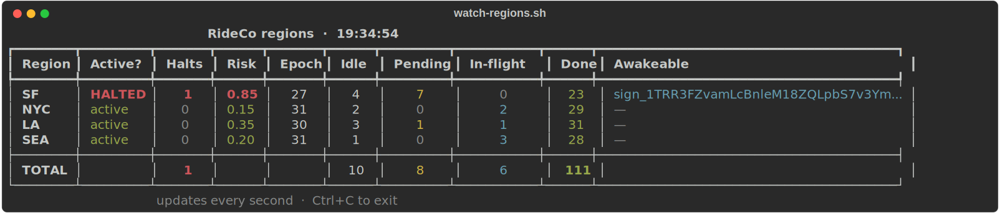

# RideCo on Restate

RideCo is a working ride-hailing backend built on
[Restate](https://restate.dev). Twelve services run as stateless Python
workers — eight app services (Trip, Offers, ETA, Pricing, Locations,
Features, Dispatch, RegionSafetyAgent) and four sim services that play
the role of external clients (RiderSim, DriverSim, MappingSim, plus a
SimControl fan-out service). All state, durability, retries, ordering,
and scheduling live inside Restate.

The repo is a reproducible demo. Three terminals, a few scripts, no Kafka, no
Redis, no separate workflow engine, no agent framework. Just Restate plus
stateless application code.


## How Restate fits in

> **Every service/handler in Restate automatically has a durable log in front of it.** Any invocation — sync RPC, async send, scheduled timer, webhook — is journaled in Restate's log *before* it executes. Durability, retry, ordering, observability — properties of every handler, transparently.

External clients (rider, driver, mapping providers, human operator) talk to
Restate's HTTP ingress. Restate journals the call and invokes the appropriate
worker. **Workers never call each other directly.** When a worker uses
`ctx.call()` or `ctx.send()` from inside a handler, the call goes back
through Restate, which routes it onward. Restate is always the hub.

**`call()` vs `send()`.** Every handler supports both — the choice is at
the call site. `call()` is synchronous: the caller awaits the response.
`send()` is asynchronous: fire-and-forget, returns immediately. Both
journal the invocation in the Restate log first, so both are durable from
the moment Restate acks. A trip request that uses `call()` blocks waiting
for the result; a GPS ping that uses `send()` returns the moment Restate
has the message.

## All workers are stateless

Each of the twelve services is an ordinary Python process behind hypercorn —
no local state, no RocksDB, no Redis sessions, no consumer-group offsets to
maintain. The workers can be killed and restarted at will, scaled
horizontally without coordination, run anywhere a regular HTTP service can
run. **Every operational concern that usually sticks to "stateful services"
lives in Restate.** That's a substantial simplification: deploy stateless
workers behind a load balancer, run a Restate cluster, done.

## Virtual Objects

Most of RideCo's services are **Virtual Objects** keyed by a domain
identifier — Trip per `trip_id`, Pricing per `region`, Locations per
`driver_id`, Features per `entity:id:feature_name`. Two properties matter:

- **Per-key state.** A VO instance "always exists" for its key; state
  survives across processes and restarts.
- **Per-key serialization.** Exclusive handlers for the same key run
  one-at-a-time — no locks, no coordination service. Shared handlers
  (read-only) can run concurrently. This is why Dispatch's `close_epoch`
  for SF can't race itself, and why Trip's lifecycle stays consistent
  under concurrent updates.

## Four domains, plus serving

Restate covers four backend domains that have historically required separate
substrates. RideCo exercises all four:

**Event-driven applications.** Services triggered by events on a log. The
caller doesn't wait for a result, only for the event to be durable. In
RideCo: mapping providers publishing into Features, driver apps publishing
GPS pings into Locations, Trip sending into Dispatch.

**Stateful microservices.** Regular request/response services that may keep
per-key state. Callers await results synchronously. In RideCo: Trip, Offers,
ETA, Pricing — the synchronous application path from rider tap to quoted
offer.

**Durable Execution.** Long-running operations with automatic retries, a
durable journal that avoids re-running successful steps, timers (delayed
calls), and awakeables for human-in-the-loop or async waits. In RideCo:
Dispatch's batched matching rounds and RegionSafetyAgent's per-region monitor.

**AI agent infrastructure.** Per-agent state, suspend across long LLM calls,
human-in-the-loop via awakeables, deterministic replay of agent decisions —
all the same primitives the other three domains use, applied to LLM-driven
agents. In RideCo: RegionSafetyAgent.

**Serving** is a fifth concept layered on top of these: a service that
ingests events (event-driven app, write side) AND serves a derived view via
sync `get` reads (serving, read side). Locations and Features are both —
they receive fire-and-forget writes from external publishers and respond to
sync reads from internal consumers. Serving reads aren't drawn as request
arrows in the architecture diagram; they're implicit.

## Per-service breakdown

How each service is shaped, what it owns, what it calls. Every row in
every "Calls" cell goes through Restate — `call()` is sync (caller
awaits), `send()` is async fire-and-forget into the Restate log,
self-`send()` with a delay replaces external schedulers.

### Trip — Stateful microservice

The only orchestrator. `confirm` is a long-running operation: creates an
awakeable, sends one-way to `Dispatch.enqueue_trip` carrying the awakeable
name, and **suspends** on the awakeable. When Dispatch's next matching
round resolves the awakeable with a `driver_id`, the same `confirm`
invocation resumes, records the assignment, and fans out to Locations.
After assignment, schedules a delayed self-send to `complete` that flips
the driver back to idle when the simulated ride ends. Trip → Dispatch is
a one-way dependency; Dispatch never imports Trip.

| | |
|---|---|
| **Domain** | Stateful microservices + Durable execution |
| **Shape** | Virtual Object keyed by `trip_id` |
| **Receives** | `call()`: `request_ride`, `confirm`, `cancel`, `complete` &nbsp;·&nbsp; shared read: `get` |
| **State** | `rider_id`, `origin`, `destination`, `region`, `status`, `offer`, `multiplier`, `assigned_driver_id`, `epoch_id`, `pending_match_awakeable` |
| **Calls** | `call()` → `Offers.generate` &nbsp;·&nbsp; `send()` → `Pricing.note_demand`, `Dispatch.enqueue_trip` (with awakeable token), `Locations.accept_trip` &nbsp;·&nbsp; self-`send()` → `complete` (delayed) |

### Offers — Stateful microservice

Pure synthesis layer. Fans into ETA + Pricing in sequence, builds three
candidate offers per car class (Standard, XL, Lux), selects Standard.

| | |
|---|---|
| **Domain** | Stateful microservices |
| **Shape** | Plain service (no per-key state) |
| **Receives** | `call()` from Trip: `generate` |
| **State** | — |
| **Calls** | `call()` → `ETA.estimate`, `Pricing.quote` |

### ETA — Stateful microservice

Arrival-time predictor. Computes haversine distance, adjusts by region
features, returns ETA + reliability score.

| | |
|---|---|
| **Domain** | Stateful microservices |
| **Shape** | Plain service (no per-key state) |
| **Receives** | `call()` from Offers: `estimate` |
| **State** | — |
| **Calls** | `call()` → `Features.get` (region `weather`, `accident_density`) |

### Pricing — Stateful microservice

Per-region surge multiplier. The refresh loop is a delayed call to self
— no external scheduler.

| | |
|---|---|
| **Domain** | Stateful microservices + Durable execution |
| **Shape** | Virtual Object keyed by `region` |
| **Receives** | `call()` from Offers: `quote` &nbsp;·&nbsp; `send()`: `note_demand` (Trip), `note_supply` (DriverSim) &nbsp;·&nbsp; self-scheduled: `refresh` |
| **State** | `multiplier`, `supply_count`, `demand_count`, `last_refresh_ms` |
| **Calls** | `call()` → `Features.get` &nbsp;·&nbsp; self-`send()` → `refresh` in 10s |

### Locations — Event-driven app + Serving

Per-driver position + status. Pings are fire-and-forget; the smoothing
(mocked here as an exponential moving average; production systems would
use a Marginalized Particle Filter) happens inside the handler. Position
reads via the shared `get_position` handler are the serving path.

| | |
|---|---|
| **Domain** | Event-driven apps + Serving |
| **Shape** | Virtual Object keyed by `driver_id` |
| **Receives** | `send()`: `ping` (driver app), `accept_trip` (Trip) &nbsp;·&nbsp; `call()`: `set_status` &nbsp;·&nbsp; shared read: `get_position` |
| **State** | `status`, `matched_lat`, `matched_lng`, `last_ping_ms`, `region`, `current_trip_id` |
| **Calls** | `send()` → `Dispatch.register_driver` / `deregister_driver` on status transitions |

### Features — Event-driven app + Serving

Online feature store. External providers `send()` writes; Restate journals
each write and invokes `Features.set` on the right key. Internal readers
`call()` `get` to retrieve the current value.

| | |
|---|---|
| **Domain** | Event-driven apps + Serving |
| **Shape** | Virtual Object keyed by `{entity_type}:{entity_id}:{feature_name}` |
| **Receives** | `send()` from external providers + internal callers: `set` &nbsp;·&nbsp; shared read: `get` |
| **State** | `value`, `version`, `last_updated_ms` |
| **Calls** | — |

### Dispatch — Durable execution

Long-running matcher. Each epoch: snapshot pending trips + driver
positions, greedy nearest-driver match, resolve each matched trip's
awakeable token with its `driver_id`. Unmatched trips carry forward.
Dispatch has no knowledge of Trip's state machine — it just resolves
tokens it was handed. When RegionSafetyAgent halts the region, the
epoch loop keeps ticking but matching is skipped; trips queue and drain
on resume.

| | |
|---|---|
| **Domain** | Durable execution |
| **Shape** | Virtual Object keyed by `region` |
| **Receives** | `send()`: `enqueue_trip` (Trip, with awakeable token), `register_driver` / `deregister_driver` (Locations), `set_active` (RegionSafetyAgent) &nbsp;·&nbsp; self-scheduled: `close_epoch` every 5s |
| **State** | `active`, `active_driver_ids`, `pending_trips` (each with its awakeable token), `epoch_id`, `loop_running` |
| **Calls** | `call()` → `Locations.get_position` (per active driver at epoch close) &nbsp;·&nbsp; `ctx.resolve_awakeable` per matched trip — Dispatch's only outbound communication &nbsp;·&nbsp; self-`send()` → `close_epoch` in 5s |

### RegionSafetyAgent — AI agent infrastructure

Per-region safety monitor. Every 10s, reads its region's features,
computes a composite risk via the mocked LLM, and decides whether to
halt dispatch. On halt: `send()`s `Dispatch.set_active(false)`, creates
an awakeable, suspends. A human resolves the awakeable with `approve`
(region resumes, `Dispatch.set_active(true)`) or `deny` (stays halted;
ticks continue but no re-escalation until something resumes the region).
Trips in the halted region queue in Dispatch's `pending_trips` and drain
on resume. One agent per region — SF can be halted while NYC, LA, SEA
keep matching.

| | |
|---|---|
| **Domain** | AI agent infrastructure |
| **Shape** | Virtual Object keyed by `region` |
| **Receives** | `send()`: `start_monitoring` (from MappingSim on bootstrap), `force_resume` (manual override) &nbsp;·&nbsp; self-scheduled: `tick` every 10s &nbsp;·&nbsp; external awakeable resolve from human operator &nbsp;·&nbsp; shared read: `get` |
| **State** | `active`, `region_active`, `ticks`, `halts`, `last_score`, `last_rationale`, `last_verdict`, `pending_awakeable` |
| **Calls** | `call()` → `Features.get` (region `weather`, `accident_density`) &nbsp;·&nbsp; `ctx.run_typed` for the composite risk score (journaled, deterministic on replay) &nbsp;·&nbsp; `send()` → `Dispatch.set_active(false)` to halt, `Dispatch.set_active(true)` on approve &nbsp;·&nbsp; `ctx.awakeable()` to suspend on a human verdict &nbsp;·&nbsp; self-`send()` → `tick` in 10s |

The AI-agent showcase: per-key state, mocked LLM via `ctx.run`, awakeable
for human-in-the-loop gating, all on Restate's durable runtime. Same
primitives the other seven services use, applied to LLM-driven decisions.

## Sim services

Even the load generators are built on Restate. `RiderSim`, `DriverSim`,
and `MappingSim` are Virtual Objects with their own durable cadence
loops, paused and tuned via the same `call()` / `send()` primitives the
app uses. `SimControl` is a fan-out controller — one call to
`start_all` boots the whole fleet; one call to `stop_all` pauses it.

This sharpens the pitch: there's no "and we also have a Python load
generator on the side." The sims look like external clients from the
app's perspective (each `RiderSim.tick` calls `Trip.request_ride` like
any other caller), but they're durable Restate services themselves —
state survives restarts, cadence loops survive worker churn, every emit
journals through the same log.

### RiderSim — load generator (Stateful microservice + Durable execution)

Each rider VO owns its own rate and trip counter. `tick` picks a random
region, fires `Trip.request_ride` + `Trip.confirm`, and self-sends the
next `tick` with a Poisson-jittered delay.

| | |
|---|---|
| **Domain** | Stateful microservices + Durable execution |
| **Shape** | Virtual Object keyed by `rider_id` |
| **Receives** | `call()`: `start`, `pause`, `resume`, `set_rate` &nbsp;·&nbsp; self-scheduled: `tick` (Poisson-jittered) &nbsp;·&nbsp; shared read: `get` |
| **State** | `active`, `rate`, `trips_started`, `last_trip_id`, `last_region` |
| **Calls** | `call()` → `Trip.request_ride` &nbsp;·&nbsp; `send()` → `Trip.confirm` &nbsp;·&nbsp; `ctx.run_typed` for jittered origin/destination/region/delay (journaled) &nbsp;·&nbsp; self-`send()` → `tick` |

### DriverSim — load generator (Stateful microservice + Durable execution)

Each driver VO owns its position and ping cadence. On first start it
registers as IDLE with `Locations` and bumps regional supply. The
`tick` loop drifts the position and sends a `ping`.

| | |
|---|---|
| **Domain** | Event-driven apps + Durable execution |
| **Shape** | Virtual Object keyed by `driver_id` |
| **Receives** | `call()`: `start`, `pause`, `resume` &nbsp;·&nbsp; self-scheduled: `tick` every `ping_interval_s` &nbsp;·&nbsp; shared read: `get` |
| **State** | `active`, `region`, `lat`, `lng`, `ping_interval_s`, `pings_sent` |
| **Calls** | `call()` → `Locations.set_status(idle)` on first start &nbsp;·&nbsp; `send()` → `Locations.ping`, `Pricing.note_supply` &nbsp;·&nbsp; self-`send()` → `tick` |

### MappingSim — load generator (Event-driven app + Durable execution)

Per-region weather + accident feed. On first start it bootstraps that
region's `Pricing.refresh` and `RegionSafetyAgent.start_monitoring`
loops, then ticks on its own interval to emit fresh feature values.

| | |
|---|---|
| **Domain** | Event-driven apps + Durable execution |
| **Shape** | Virtual Object keyed by `region` |
| **Receives** | `call()`: `start`, `pause`, `resume`, `set_interval` &nbsp;·&nbsp; self-scheduled: `tick` every `interval_s` &nbsp;·&nbsp; shared read: `get` |
| **State** | `active`, `interval_s`, `emits`, `last_weather`, `last_accidents` |
| **Calls** | `send()` → `Features.set` (weather + accident_density), `Pricing.refresh` (bootstrap), `RegionSafetyAgent.start_monitoring` (bootstrap) &nbsp;·&nbsp; `ctx.run_typed` for the random pick (journaled) &nbsp;·&nbsp; self-`send()` → `tick` |

### SimControl — fleet controller

Single-key fan-out service. `start_all` boots the whole fleet from one
call; `stop_all` pauses everything; `set_rider_rate` retunes every
rider VO at once. Operators (TUI, scripts, curl) drive sims through one
small surface instead of enumerating per-key VOs.

| | |
|---|---|
| **Domain** | Stateful microservices (control plane) |
| **Shape** | Virtual Object keyed by `"global"` (single instance) |
| **Receives** | `call()`: `start_all`, `stop_all`, `pause_riders`/`drivers`/`mapping`, `resume_*`, `set_rider_rate` &nbsp;·&nbsp; shared read: `get` |
| **State** | `drivers`, `riders`, `rider_rate`, `mapping_interval_s` |
| **Calls** | `send()` → fan-out to all `RiderSim`, `DriverSim`, `MappingSim` VOs |

## Why no Kafka

This demo doesn't use Kafka anywhere. Every external write and every internal
hop goes to the Restate log via Restate's HTTP ingress.

The argument is short. Every Restate handler is durable from the moment
ingress acks the request — the Restate log handles the durable-input-queue
job a Kafka topic would otherwise do, without the cluster. For sync calls,
`call()` is just durable function-call ergonomics. For async, `send()`
writes to the same log. External publishers use `send()` the same way
internal callers do. For cadence, delayed sends replace cron and Airflow.

**Restate and Kafka coexist peacefully.** Restate has first-class Kafka
subscriptions (inbound) and producer support (outbound). But for
async/event-driven microservice workloads, Restate is just a better log:
lower latency, no consumer-group bookkeeping, durability and ordering tuned
for this exact workload. A Restate Kafka subscription literally just copies
messages from Kafka into the Restate log before any processing happens —
that extra copy is unnecessary when your producers can speak HTTP directly
to Restate in the first place. Many architectures that have Kafka today
simply don't need it.

## How to run the demo

Three terminals plus a browser tab at `http://localhost:9070`
(Restate Web UI).

Prereqs: Python 3.13 (or 3.11+), Docker, the
[`restate` CLI](https://docs.restate.dev/get_started/install), and `uv` (or
plain `pip`).

```bash
# Install once
uv venv --python 3.13 .venv
.venv/bin/python -m pip install -e .
```

**Terminal 1** — the show. Inter-service log scrolls here as the demo
runs; every cross-service hop is tagged `[sync→]` / `[send→]` / `[self→]`.

```bash
./scripts/demo-t1.sh fresh
```

Pauses for ENTER, wipes Restate state, brings up Restate, then launches
all twelve services as separate hypercorn processes (one per service,
ports 9080–9091). Their logs interleave in this terminal with each line
tagged `[service-name]`.

**Terminal 2** — guided walkthrough. Three phases, ENTER between every step.

```bash
./scripts/demo-t2.sh
```

1. **System alive** — `SimControl.start_all` boots the rider/driver/mapping VOs; constant traffic flows across all four regions.
2. **Region halts (human-in-the-loop)** — you force a region's features into unsafe territory; the RegionSafetyAgent picks it up on its next tick, halts dispatch for that region, and suspends on an awakeable; other regions keep matching unaffected.
3. **Human approves** — you POST a verdict; the same invocation resumes; dispatch comes back; the queued backlog drains.

**Terminal 3** — live dashboard. Open this once T2 is past Phase 1
(sims need to be running so there's data to show).

```bash
./scripts/watch-regions.sh
```

One row per region, refreshing every second: active/halted, halts count,
risk score, current dispatch epoch, idle drivers, pending trips, trips
in flight, completed trips, and the pending awakeable token when the
agent is suspended. A TOTAL row at the bottom rolls everything up. Watch
this while you spike a region in T2 — you'll see Risk turn yellow then
red, Active flip to HALTED, Pending climb, the awakeable populate. After
you approve, Active goes back to green, Pending drains, Done resumes
climbing.



## Poke at the running system

The dashboard in T3 is one window into the running system; there are
several others. The demo is more interesting if you don't just watch
it — open a fourth terminal and start poking.

**Restate Web UI — `http://localhost:9070`.** The best single window into
the system.

- *Services* — every registered service and handler, signatures, recent invocations.
- *Invocations* — live + historical. `running` is currently executing; `scheduled` is a delayed self-send waiting to fire (you'll always see `Dispatch.close_epoch`, `Pricing.refresh`, and `RegionSafetyAgent.tick` queued per region); `suspended` is paused on an awakeable (the per-region safety agent, or any `Trip.confirm` waiting on a match).
- *State* — per-VO key/value inspector. Click an object, click a key, see the journaled state.

**Shell views.** A few scripts pretty-print what the UI shows, useful
when you want to script around them.

```bash
./scripts/watch-regions.sh                      # live dashboard, updates in place
./scripts/show-regions.sh                       # one-shot snapshot of all four regions
./scripts/show-region.sh SF                     # one region in detail
./scripts/show-trip.sh trip-abc123              # Trip VO + status legend
./scripts/show-invocations.sh                   # restate invocations list
```

`watch-regions.sh` is the most useful one to keep open in a side
terminal during the demo — you can literally see halts flip and pending
queues drain in real time.

**Direct HTTP — same ingress the sims use.** Any handler is reachable via
Restate's ingress at `:8080`. The URL pattern is `/{Service}/{key}/{handler}`
for virtual objects (drop `{key}` for plain services), append `/send` for
fire-and-forget.

```bash
# Read a Trip VO's full state
curl -s -X POST http://localhost:8080/Trip/trip-abc123/get \
  -H 'Content-Type: application/json' -d '{}' | python3 -m json.tool

# Read a region's safety agent
curl -s -X POST http://localhost:8080/RegionSafetyAgent/SF/get \
  -H 'Content-Type: application/json' -d '{}' | python3 -m json.tool

# Read a Features VO directly by composite key
curl -s -X POST 'http://localhost:8080/Features/region:SF:weather/get' \
  -H 'Content-Type: application/json' -d '{}' | python3 -m json.tool

# Force a driver back to idle (call() — caller awaits)
curl -s -X POST http://localhost:8080/Locations/driver-001/set_status \
  -H 'Content-Type: application/json' -d '{"status":"idle","region":"SF"}'

# Fire-and-forget — append /send
curl -s -X POST http://localhost:8080/Pricing/SF/refresh/send \
  -H 'Content-Type: application/json' -d '{}'
```

Inspectors are just `call()`s like any other handler — each VO exposes
a `shared` (read-only) `get`. The UI, the shell scripts, and your own
curl are all hitting the same Restate ingress.

**Restate CLI.** The `restate` CLI talks to the admin API at `:9070`.

```bash
restate invocations list                       # everything currently in flight
restate invocations list --status suspended    # who's parked on an awakeable
restate services list                          # all registered services
```

**Things worth trying.**

- Stop one service mid-trip (find its PID in the `[service-name]` lines and kill it, or just `./scripts/stop.sh` to wipe everything), wait, restart with `./scripts/demo-t1.sh restart`. The pending `Trip.confirm` invocations resume from where they suspended; the matching loop picks back up. No state lost.
- `./scripts/spike-region.sh NYC` while SF is already halted. Two regions queued; one human verdict per region to drain.
- Write a feature directly (`./scripts/set-feature.sh SF accident_density 0.9`) and watch the next `RegionSafetyAgent[SF].tick` catch it.
- In the Web UI, find a `RegionSafetyAgent.tick` invocation in *suspended* state, click through to its journal — every step is recorded, including the awakeable it's waiting on.

## Scripts reference

| Script | Purpose |
|---|---|
| `./scripts/demo-t1.sh [fresh\|restart]` | Terminal 1 driver (fresh wipes state, restart picks up code changes) |
| `./scripts/demo-t2.sh` | Terminal 2 guided 3-phase walkthrough |
| `./scripts/reset.sh` | Wipe Restate state and restart the container |
| `./scripts/serve-all.sh` | Launch all 12 services as separate hypercorn processes (foreground, Ctrl+C tears all down) |
| `./scripts/register-all.sh` | Register all 12 deployments with Restate |
| `./scripts/stop.sh` | Kill anything listening on 9080–9091 |
| `./scripts/setup-region.sh <region>` | Initialize a region: clear features + one idle driver |
| `./scripts/make-trip.sh <trip_id> <region>` | Rider request + confirm (sync; confirm waits for match) |
| `./scripts/make-trip-send.sh <trip_id> <region>` | Same but fire-and-forget request_ride |
| `./scripts/complete-trip.sh <trip_id>` | Mark a trip complete |
| `./scripts/spike-region.sh [region]` | Force a region's features into unsafe territory (triggers RegionSafetyAgent to halt) |
| `./scripts/show-region.sh [region]` | Pretty-print one region's RegionSafetyAgent + Dispatch state |
| `./scripts/show-regions.sh` | At-a-glance table across all four regions (active?, halts, risk, drivers/pending, awakeable) |
| `./scripts/watch-regions.sh` | Live dashboard — same columns, updates in place every second |
| `./scripts/cancel-trip.sh <trip_id>` | Cancel a trip |
| `./scripts/set-feature.sh <region> <feature> <value>` | Write a feature directly via HTTP |
| `./scripts/poison.sh [region]` | Publish the POISON sentinel into Features for that region |
| `./scripts/approve.sh <awakeable_id> [verdict]` | Resolve a suspended RegionSafetyAgent awakeable |
| `./scripts/show-trip.sh <trip_id>` | Pretty-print Trip state with a status legend |
| `./scripts/show-invocations.sh` | `restate invocations list` with a status legend |

## Versions

- **Restate server:** 1.6.2 (pinned in `docker-compose.yml`)
- **Restate Python SDK:** `restate_sdk[serde]` 0.18.0
- **Python:** 3.13
- **ASGI server:** Hypercorn (HTTP/2)

## Layout

```
rideco/
├── architecture.svg           # diagram, embedded above
├── docker-compose.yml         # restate-server 1.6.2 — the whole stack
├── hypercorn-config.toml      # ASGI defaults (per-service --bind passes overrides)
├── pyproject.toml             # restate_sdk[serde], hypercorn, httpx, rich
├── Makefile                   # serve, register, stop
├── scripts/                   # demo scripts — see Scripts reference above
├── rideco/
│   ├── shared/                # types, region defs, color logging w/ flow tags
│   ├── services/              # app: trip, offers, dispatch, locations, pricing,
│   │                          #      eta, features, region_safety_agent
│   │                          # sim: sim_rider, sim_driver, sim_mapping,
│   │                          #      sim_control (load generators on Restate)
│   └── sim/                   # watch_regions — live dashboard (external)
```

Each service runs as its own hypercorn process on its own port
(`serve-all.sh` spawns all twelve). They never call each other directly —
every cross-service hop goes through Restate, so killing or restarting
one process has zero effect on the others. The TUI in development takes
this one step further by owning the per-service lifecycle.
